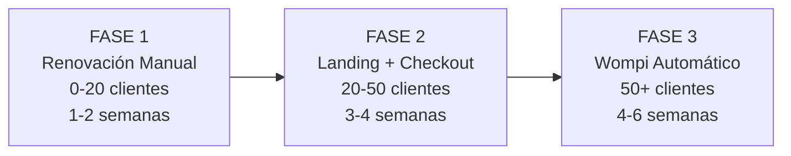
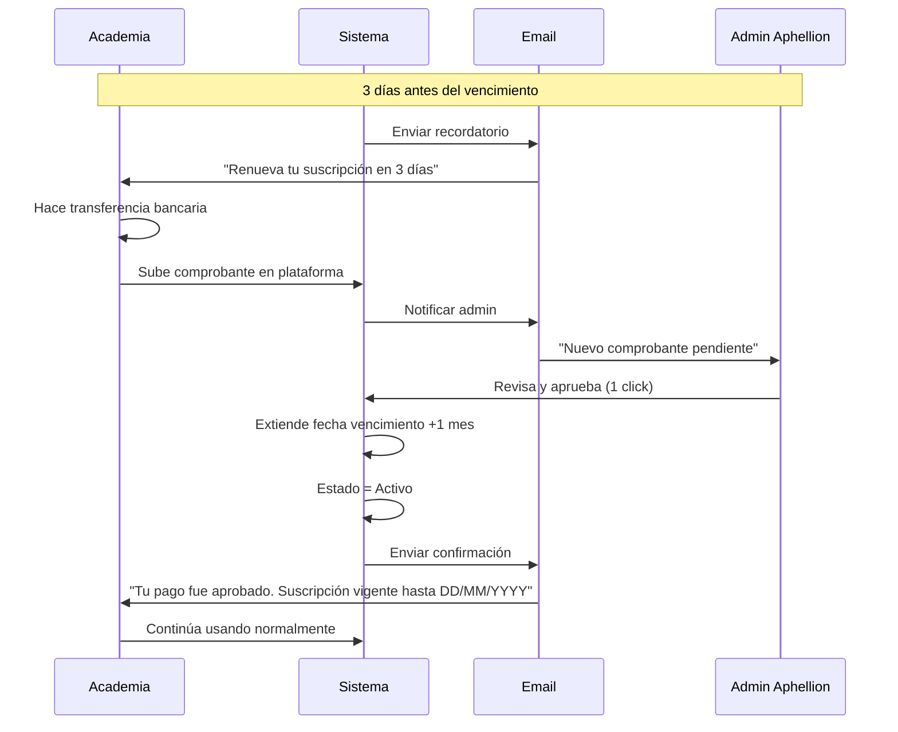

# 💳 PLAN DE IMPLEMENTACIÓN - SISTEMA DE SUSCRIPCIONES

**Versión:** 1.0  
**Fecha:** 27 de Febrero de 2026  
**Autor:** Equipo Técnico Chetango  
**Propósito:** Guía de implementación del sistema de cobro y gestión de suscripciones para Aphellion SaaS

---

## 📋 ÍNDICE

1. [Contexto y Decisión](#contexto-y-decisión)
2. [Estrategia Elegida](#estrategia-elegida)
3. **[Arquitectura de Roles y Permisos](#arquitectura-de-roles-y-permisos)** ⭐ NUEVO
4. [Fase 1: Renovación Manual Automatizada](#fase-1-renovación-manual-automatizada)
5. [Fase 2: Landing Page y Checkout](#fase-2-landing-page-y-checkout)
6. [Fase 3: Pasarela de Pago Automática](#fase-3-pasarela-de-pago-automática)
7. [Comparación de Alternativas](#comparación-de-alternativas)
8. [Anexos Técnicos](#anexos-técnicos)

---

## 🎯 CONTEXTO Y DECISIÓN

### Situación Actual

**Estado del proyecto:**
- ✅ Plataforma operativa en producción
- ✅ Dominio neutral configurado (aphellion.com)
- ✅ Primer cliente: Corporación Chetango (corporacionchetango.aphellion.com)
- ✅ Infraestructura lista para multi-tenancy
- ⚠️ Sin sistema de cobro de suscripciones implementado
- ⚠️ **Falta implementar:** Modelo multi-tenant en base de datos (TenantId)

**Necesidad:**
Implementar sistema para cobrar mensualmente a las academias suscritas al SaaS.

### ⚠️ PREREQUISITO IMPORTANTE: Multi-Tenancy en Base de Datos

Este plan de suscripciones **asume que ya implementaste el modelo multi-tenant** descrito en [PLAN-ESCALAMIENTO-SAAS.md - Sección 3](./PLAN-ESCALAMIENTO-SAAS.md#3-arquitectura-multi-tenant).

**Resumen del modelo:**
- **Una sola base de datos** para todas las academias
- Cada tabla principal tiene columna `TenantId` (referencia a `Tenants.Id`)
- Entity Framework filtra automáticamente por `TenantId` (Global Query Filters)
- Middleware identifica tenant por subdomain (`corporacionchetango.aphellion.com` → TenantId)
- **Aislamiento total:** Academia A nunca puede ver datos de Academia B

**Ejemplo:**
```sql
-- Tabla Alumnos (TODOS los alumnos de TODAS las academias)
CREATE TABLE Alumnos (
    Id UNIQUEIDENTIFIER PRIMARY KEY,
    TenantId UNIQUEIDENTIFIER NOT NULL,  -- ← Identifica a qué academia pertenece
    Nombre NVARCHAR(200),
    Correo NVARCHAR(100),
    -- ... otros campos
    FOREIGN KEY (TenantId) REFERENCES Tenants(Id)
);

-- Cuando Corporación Chetango hace query:
SELECT * FROM Alumnos WHERE TenantId = 'xxx-aaa'  -- Solo ve SUS alumnos

-- Cuando Salsa Caleña hace query:
SELECT * FROM Alumnos WHERE TenantId = 'xxx-bbb'  -- Solo ve SUS alumnos
```

**Si aún NO implementaste TenantId:**
1. Lee primero [PLAN-ESCALAMIENTO-SAAS.md - Sección 3](./PLAN-ESCALAMIENTO-SAAS.md#3-arquitectura-multi-tenant)
2. Implementa Fase 1 del escalamiento (agregar TenantId a todas las tablas)
3. Luego regresa a este documento para implementar suscripciones

**Si YA implementaste TenantId:**
✅ Puedes continuar con este plan normalmente.

### Alternativas Evaluadas

#### ❌ **Opción 1: Pasarela de Pago Automática (Stripe/Wompi)**
- **Pros:** Automatización 100%, profesional, escalable
- **Contras:** Comisiones 3% ($500K/mes con 50 clientes), complejidad técnica (4-6 semanas), curva de aprendizaje
- **Veredicto:** Demasiado costoso y complejo para fase inicial

#### ❌ **Opción 2: Transferencia 100% Manual**
- **Pros:** $0 comisiones, simple
- **Contras:** Alto trabajo manual, no escalable, mala experiencia de usuario
- **Veredicto:** No escalable, alto riesgo de churn

#### ✅ **Opción 3: HÍBRIDA - Transferencia Manual Automatizada (ELEGIDA)**
- **Pros:** $0 comisiones, rápida implementación (1 semana), buena UX, escalable hasta 30-50 clientes
- **Contras:** Requiere aprobación manual (5 min/pago)
- **Veredicto:** **IDEAL para fase inicial** → Migrar a Wompi cuando tengamos 20+ clientes

---

## 🚀 ESTRATEGIA ELEGIDA

### Enfoque de Implementación por Fases



**Razones de esta estrategia:**
1. ✅ **Validación temprana** - Probamos el modelo de negocio con inversión mínima
2. ✅ **Ahorro de costos** - $0 en comisiones durante primeros 6-12 meses
3. ✅ **Time to market** - Sistema funcional en 1-2 semanas vs 2-3 meses
4. ✅ **Feedback directo** - Contacto cercano con primeros clientes
5. ✅ **Flexibilidad** - Podemos pivotar sin costos hundidos en integraciones

---

## � ARQUITECTURA DE ROLES Y PERMISOS

### ⭐ Enfoque: Usuario Actual con DOBLE ROL (Admin + SuperAdmin)

**Decisión de Implementación:**
Para simplificar la operación inicial, el usuario actual de Chetango tendrá **AMBOS roles** simultáneamente en el mismo usuario. Esto evita crear un nuevo usuario y gestionar múltiples sesiones.

#### **Configuración del Usuario:**

```
Email: chetango.corporacion@corporacionchetango.com (usuario actual)
TenantId: [GUID de Corporación Chetango] (SÍ tiene TenantId, NO es NULL)
Roles Azure AD: Admin + SuperAdmin (AMBOS asignados al mismo usuario)
```

#### **Resultado con Doble Rol:**

| Funcionalidad | Como Admin | Como SuperAdmin |
|---------------|------------|------------------|
| **Gestiona Corporación Chetango** | ✅ Alumnos, Profesores, Clases | ✅ También puede verlos |
| **Ve "Mi Suscripción"** | ✅ Su propia academia | ✅ También la ve |
| **Ve "Gestión de Suscripciones"** | ❌ | ✅ TODAS las academias |
| **Aprueba pagos de otras academias** | ❌ | ✅ Sí puede |
| **Crea nuevas academias** | ❌ | ✅ Sí puede |
| **Sesiones requeridas** | 1 sola sesión | 1 sola sesión |

#### **Ventajas de este Enfoque:**

✅ **Simplicidad operativa**: Una sola cuenta, una sola sesión  
✅ **Sin cambio de usuario**: No necesitas cerrar sesión para cambiar entre roles  
✅ **Sidebar unificado**: Ves ambas secciones (Mi Suscripción + Gestión Global)  
✅ **Rápido de implementar**: No requiere crear nuevos usuarios ni configurar credenciales adicionales  
✅ **Migración futura**: Cuando tengas 10+ academias, puedes crear usuario SuperAdmin dedicado

#### **Cómo Funciona la Lógica:**

**Backend verifica si el usuario tiene rol SuperAdmin:**
```csharp
// Si el usuario tiene rol "SuperAdmin" → Ignora su TenantId y ve TODO
if (user.Roles.Contains("SuperAdmin")) 
{
    return _context.Alumnos.ToList(); // SIN filtro de TenantId
}

// Si solo tiene rol "Admin" → Filtra por su TenantId
return _context.Alumnos
    .Where(a => a.TenantId == user.TenantId)
    .ToList();
```

---

### 🛠️ Implementación Técnica del SuperAdmin

#### **1. Crear Rol en Azure AD**

**Pasos en Azure Portal:**
1. Ve a **Azure AD** → **App registrations** → Tu app (`d35c1d4d-9ddc-4a8b-bb89-1964b37ff573`)
2. Click en **App roles**
3. Click **Create app role**
4. Configuración:
   - **Display name**: `SuperAdmin`
   - **Allowed member types**: `Users/Groups`
   - **Value**: `SuperAdmin` (case-sensitive, debe coincidir con código)
   - **Description**: `Super administrador con acceso a todos los tenants`
   - **Enable this app role**: ✅ Checked
5. Click **Apply**

#### **2. Asignar Rol SuperAdmin al Usuario Actual**

**Pasos en Azure AD:**

1. Ve a **Azure AD** → **Enterprise applications** → Tu app
2. Click **Users and groups**
3. Busca tu usuario: `chetango.corporacion@corporacionchetango.com`
4. Click en el usuario → **Edit assignment**
5. En **Select a role** → Agregar rol `SuperAdmin` (sin quitar el rol `Admin`)
6. Click **Save**

**Resultado:** Tu usuario tendrá ambos roles:
- ✅ Admin (ya lo tenía)
- ✅ SuperAdmin (recién agregado)

**Nota:** Azure AD permite que un usuario tenga múltiples roles. No es necesario crear un usuario nuevo.

#### **3. Actualizar Backend para Reconocer SuperAdmin**

**Archivo: `Program.cs`**

```csharp
// Agregar política de autorización para SuperAdmin
builder.Services.AddAuthorization(options =>
{
    options.AddPolicy("AdminOnly", policy => 
        policy.RequireRole("Admin", "SuperAdmin"));
    
    options.AddPolicy("SuperAdminOnly", policy => 
        policy.RequireRole("SuperAdmin"));
    
    options.AddPolicy("ProfesorOnly", policy => 
        policy.RequireRole("Profesor"));
});
```

**Archivo: `Controllers/SuscripcionController.cs`**

```csharp
[HttpGet("suscripciones")]
[Authorize(Roles = "Admin,SuperAdmin")]
public async Task<IActionResult> GetSuscripciones()
{
    var user = await _userManager.GetUserAsync(User);
    var roles = await _userManager.GetRolesAsync(user);
    
    // Si tiene rol SuperAdmin → Ve TODAS las academias (ignora su TenantId)
    if (roles.Contains("SuperAdmin"))
    {
        var todas = await _context.PagosSuscripcion
            .Include(p => p.Tenant)
            .OrderByDescending(p => p.FechaPago)
            .ToListAsync();
        return Ok(todas);
    }
    
    // Si solo tiene Admin → Ve su academia
    var tenantId = user.TenantId;
    var misSuscripciones = await _context.PagosSuscripcion
        .Where(p => p.TenantId == tenantId)
        .OrderByDescending(p => p.FechaPago)
        .ToListAsync();
    return Ok(misSuscripciones);
}
```

#### **4. Servicio Helper para Verificar Roles**

**Archivo: `Services/UserService.cs`**

```csharp
public class UserService
{
    private readonly UserManager<ApplicationUser> _userManager;
    
    public async Task<bool> IsSuperAdmin(ClaimsPrincipal user)
    {
        var appUser = await _userManager.GetUserAsync(user);
        var roles = await _userManager.GetRolesAsync(appUser);
        return roles.Contains("SuperAdmin");
    }
    
    public async Task<Guid?> GetUserTenantId(ClaimsPrincipal user)
    {
        var appUser = await _userManager.GetUserAsync(user);
        return appUser.TenantId; // NULL para SuperAdmin
    }
}
```

#### **5. Base de Datos (Sin Cambios Especiales)**

```sql
-- Agregar columna TenantId a usuarios (si no existe)
ALTER TABLE AspNetUsers 
ADD TenantId UNIQUEIDENTIFIER NULL;

-- Asignar TenantId a usuarios existentes de Corporación Chetango
UPDATE AspNetUsers 
SET TenantId = (SELECT Id FROM Tenants WHERE Subdomain = 'corporacionchetango')
WHERE Email LIKE '%@corporacionchetango.com';

-- Tu usuario chetango.corporacion@... MANTIENE su TenantId
-- La diferencia es que ahora tiene ROL SuperAdmin en Azure AD
-- El backend verifica el rol para decidir si filtrar o no por TenantId
```

#### **6. Frontend: Mostrar Ambas Secciones**

**Archivo: `components/Sidebar.tsx`**

```tsx
import { useAuth } from '@/contexts/AuthContext';

export function Sidebar() {
  const { user } = useAuth();
  const isSuperAdmin = user.roles?.includes('SuperAdmin');
  
  return (
    <nav>
      <NavLink to="/dashboard">Dashboard</NavLink>
      <NavLink to="/alumnos">Alumnos</NavLink>
      <NavLink to="/profesores">Profesores</NavLink>
      <NavLink to="/clases">Clases</NavLink>
      <NavLink to="/pagos">Pagos</NavLink>
      <NavLink to="/paquetes">Paquetes</NavLink>
      
      {/* TODOS los admins ven "Mi Suscripción" */}
      <NavLink to="/mi-suscripcion">
        💳 Mi Suscripción
      </NavLink>
      
      {/* Solo SuperAdmin ve sección de gestión global */}
      {isSuperAdmin && (
        <>
          <hr className="my-2" />
          <div className="text-xs text-gray-500 px-4">Super Admin</div>
          <NavLink to="/gestion-suscripciones">
            💰 Gestión de Suscripciones
          </NavLink>
          <NavLink to="/gestion-tenants">
            🏢 Gestión de Academias
          </NavLink>
        </>
      )}
    </nav>
  );
}
```

---

### 📊 Resumen de Usuarios

| Email | Roles Azure | TenantId | Sidebar Visible | Qué Gestiona |
|-------|-------------|----------|-----------------|--------------|
| `chetango.corporacion@corporacionchetango.com` | **Admin + SuperAdmin** | `corp-chetango-guid` | Mi Suscripción + Gestión Suscripciones Global + Gestión Academias | Corp. Chetango + TODAS las academias |
| `admin@salsacalena.com` | Admin | `salsa-calena-guid` | Mi Suscripción, Alumnos, Profesores, Clases | Solo Salsa Caleña |
| `profesor1@chetango.com` | Profesor | `corp-chetango-guid` | Clases, Asistencias | Solo sus clases en Corp. Chetango |
| `alumno1@chetango.com` | Alumno | `corp-chetango-guid` | Mis Clases, Mi Perfil | Solo sus datos |

---

## �📍 FASE 1: RENOVACIÓN MANUAL AUTOMATIZADA

**Timeline:** Semana 1-2 (Implementar YA)  
**Objetivo:** Academia puede renovar su suscripción subiendo comprobantes  
**Alcance:** 0-20 academias  

### 1.1 ¿Qué Vamos a Implementar?

#### **Sección "Mi Suscripción" en la App**

Ubicación en la interfaz:
```
corporacionchetango.aphellion.com/admin
├── Dashboard
├── Alumnos
├── Clases
├── Profesores
├── Pagos (de alumnos)
└── 🆕 Mi Suscripción  ← NUEVA SECCIÓN
    ├── Estado de mi plan
    ├── Información de pago (datos bancarios)
    ├── Subir comprobante de renovación
    └── Historial de pagos de suscripción
```

#### **Funcionalidades:**

**Para la Academia (Cliente):**
1. ✅ Ver estado actual de suscripción (activo, días restantes)
2. ✅ Ver datos bancarios para transferencia
3. ✅ Ver referencia única de pago (ej: `APHE-CHETANGO-2026-03`)
4. ✅ Subir comprobante de pago (PDF, JPG, PNG hasta 5MB)
5. ✅ Ver historial de pagos (fecha, monto, estado)
6. ✅ Recibir notificaciones automáticas:
   - 3 días antes del vencimiento: "Recuerda renovar"
   - 1 día después del vencimiento: "Período de gracia 48h"
   - 3 días después del vencimiento: Sistema bloqueado

**Para Nosotros (Aphellion Admin):**
1. ✅ Recibir notificación cuando academia sube comprobante
2. ✅ Panel para aprobar/rechazar comprobantes (1 click)
3. ✅ Sistema extiende automáticamente suscripción al aprobar
4. ✅ Dashboard con pagos pendientes de revisar
5. ✅ Historial completo de todas las transacciones

---

### 1.2 Componentes Técnicos

#### **A. Base de Datos - Tabla Nueva**

```sql
CREATE TABLE PagosSuscripcion (
    Id UNIQUEIDENTIFIER PRIMARY KEY DEFAULT NEWID(),
    TenantId UNIQUEIDENTIFIER NOT NULL,
    
    -- Información del pago
    FechaPago DATETIME NOT NULL,
    Monto DECIMAL(18,2) NOT NULL,
    Referencia NVARCHAR(50) NOT NULL UNIQUE,  -- APHE-CHETANGO-2026-03
    MetodoPago NVARCHAR(50) NOT NULL,         -- Transferencia, Stripe, Wompi
    
    -- Comprobante
    ComprobanteUrl NVARCHAR(500),             -- URL en Azure Blob Storage
    NombreArchivo NVARCHAR(200),
    TamanoArchivo INT,                        -- En bytes
    
    -- Estado y aprobación
    Estado NVARCHAR(20) NOT NULL,             -- Pendiente, Aprobado, Rechazado
    AprobadoPor NVARCHAR(100),                -- Usuario que aprobó
    FechaAprobacion DATETIME,
    Observaciones NVARCHAR(500),              -- Razón de rechazo u otros comentarios
    
    -- Auditoría
    CreadoPor NVARCHAR(100),
    FechaCreacion DATETIME DEFAULT GETDATE(),
    ModificadoPor NVARCHAR(100),
    FechaModificacion DATETIME,
    
    FOREIGN KEY (TenantId) REFERENCES Tenants(Id)
);

-- Índices para optimización
CREATE INDEX IX_PagosSuscripcion_TenantId ON PagosSuscripcion(TenantId);
CREATE INDEX IX_PagosSuscripcion_Estado ON PagosSuscripcion(Estado);
CREATE INDEX IX_PagosSuscripcion_FechaPago ON PagosSuscripcion(FechaPago DESC);
```

#### **B. Configuración de Pagos**

```sql
CREATE TABLE ConfiguracionPagos (
    Id INT PRIMARY KEY IDENTITY(1,1),
    
    -- Datos bancarios
    Banco NVARCHAR(100) NOT NULL,            -- Bancolombia
    TipoCuenta NVARCHAR(50) NOT NULL,        -- Ahorros, Corriente
    NumeroCuenta NVARCHAR(50) NOT NULL,      -- 123-456-789
    Titular NVARCHAR(200) NOT NULL,          -- Aphellion SAS
    NIT NVARCHAR(50),                        -- 900.123.456-7
    
    -- Configuración
    Activo BIT DEFAULT 1,
    MostrarEnPortal BIT DEFAULT 1,
    
    -- Auditoría
    FechaCreacion DATETIME DEFAULT GETDATE(),
    CreadoPor NVARCHAR(100),
    FechaModificacion DATETIME,
    ModificadoPor NVARCHAR(100)
);

-- Insertar configuración inicial
INSERT INTO ConfiguracionPagos (Banco, TipoCuenta, NumeroCuenta, Titular, NIT, CreadoPor)
VALUES ('Bancolombia', 'Ahorros', '123-456-789', 'Aphellion SAS', '900.123.456-7', 'SYSTEM');
```

---

#### **C. Backend - Endpoints Nuevos**

**Archivo:** `Chetango.Api/Controllers/SuscripcionController.cs`

```csharp
[ApiController]
[Route("api/suscripcion")]
[Authorize]
public class SuscripcionController : ControllerBase
{
    // 1. Obtener estado de suscripción de mi academia
    [HttpGet("mi-estado")]
    [Authorize(Roles = "Admin")]
    public async Task<IActionResult> ObtenerEstadoSuscripcion()
    {
        var tenantId = User.GetTenantId();
        var tenant = await _context.Tenants.FindAsync(tenantId);
        
        return Ok(new {
            plan = tenant.Plan,
            estado = tenant.Estado,
            fechaVencimiento = tenant.FechaVencimientoPlan,
            diasRestantes = (tenant.FechaVencimientoPlan - DateTime.Today).Days,
            monto = ObtenerMontoPlan(tenant.Plan)
        });
    }
    
    // 2. Obtener configuración de pago (datos bancarios)
    [HttpGet("configuracion-pago")]
    public async Task<IActionResult> ObtenerConfiguracionPago()
    {
        var config = await _context.ConfiguracionPagos
            .Where(c => c.Activo && c.MostrarEnPortal)
            .FirstOrDefaultAsync();
            
        return Ok(config);
    }
    
    // 3. Generar referencia única de pago
    [HttpGet("generar-referencia")]
    [Authorize(Roles = "Admin")]
    public async Task<IActionResult> GenerarReferencia()
    {
        var tenantId = User.GetTenantId();
        var tenant = await _context.Tenants.FindAsync(tenantId);
        var mes = DateTime.Now.ToString("yyyy-MM");
        var referencia = $"APHE-{tenant.Subdomain.ToUpper()}-{mes}";
        
        return Ok(new { referencia });
    }
    
    // 4. Subir comprobante de pago
    [HttpPost("comprobante")]
    [Authorize(Roles = "Admin")]
    [RequestSizeLimit(5_242_880)] // 5 MB
    public async Task<IActionResult> SubirComprobante([FromForm] SubirComprobanteDto dto)
    {
        var tenantId = User.GetTenantId();
        
        // Validar archivo
        if (dto.Archivo == null || dto.Archivo.Length == 0)
            return BadRequest("Debe proporcionar un archivo");
            
        var extensionesPermitidas = new[] { ".pdf", ".jpg", ".jpeg", ".png" };
        var extension = Path.GetExtension(dto.Archivo.FileName).ToLower();
        
        if (!extensionesPermitidas.Contains(extension))
            return BadRequest("Solo se permiten archivos PDF, JPG o PNG");
        
        // Subir a Azure Blob Storage
        var nombreArchivo = $"{tenantId}/{Guid.NewGuid()}{extension}";
        var comprobanteUrl = await _storageService.UploadAsync(
            dto.Archivo,
            $"comprobantes-suscripcion/{nombreArchivo}"
        );
        
        // Crear registro de pago
        var pago = new PagoSuscripcion
        {
            TenantId = tenantId,
            FechaPago = dto.FechaPago,
            Monto = dto.Monto,
            Referencia = dto.Referencia,
            MetodoPago = "Transferencia",
            ComprobanteUrl = comprobanteUrl,
            NombreArchivo = dto.Archivo.FileName,
            TamanoArchivo = (int)dto.Archivo.Length,
            Estado = "Pendiente",
            CreadoPor = User.Identity.Name,
            FechaCreacion = DateTime.UtcNow
        };
        
        await _context.PagosSuscripcion.AddAsync(pago);
        await _context.SaveChangesAsync();
        
        // Notificar a admin interno
        await _notificationService.NotificarComprobantePendiente(pago);
        
        return Ok(new { 
            mensaje = "Comprobante recibido. Lo revisaremos y aprobaremos en máximo 2 horas.",
            pagoId = pago.Id
        });
    }
    
    // 5. Obtener historial de pagos de mi academia
    [HttpGet("historial")]
    [Authorize(Roles = "Admin")]
    public async Task<IActionResult> ObtenerHistorial()
    {
        var tenantId = User.GetTenantId();
        
        var pagos = await _context.PagosSuscripcion
            .Where(p => p.TenantId == tenantId)
            .OrderByDescending(p => p.FechaPago)
            .Select(p => new {
                p.Id,
                p.FechaPago,
                p.Monto,
                p.Referencia,
                p.Estado,
                p.ComprobanteUrl,
                p.FechaAprobacion,
                p.Observaciones
            })
            .ToListAsync();
            
        return Ok(pagos);
    }
}
```

**Archivo:** `Chetango.Api/Controllers/AdminPagosController.cs`

```csharp
[ApiController]
[Route("api/admin/pagos-suscripcion")]
[Authorize(Roles = "SuperAdmin")]  // Solo equipo interno Aphellion
public class AdminPagosController : ControllerBase
{
    // 1. Listar comprobantes pendientes de aprobación
    [HttpGet("pendientes")]
    public async Task<IActionResult> ObtenerPagosPendientes()
    {
        var pagos = await _context.PagosSuscripcion
            .Include(p => p.Tenant)
            .Where(p => p.Estado == "Pendiente")
            .OrderBy(p => p.FechaCreacion)
            .Select(p => new {
                p.Id,
                p.FechaPago,
                p.Monto,
                p.Referencia,
                p.ComprobanteUrl,
                Academia = p.Tenant.Nombre,
                Subdomain = p.Tenant.Subdomain,
                Plan = p.Tenant.Plan,
                p.FechaCreacion
            })
            .ToListAsync();
            
        return Ok(pagos);
    }
    
    // 2. Aprobar comprobante
    [HttpPost("{pagoId}/aprobar")]
    public async Task<IActionResult> AprobarPago(Guid pagoId, [FromBody] AprobacionDto dto)
    {
        var pago = await _context.PagosSuscripcion
            .Include(p => p.Tenant)
            .FirstOrDefaultAsync(p => p.Id == pagoId);
        
        if (pago == null) return NotFound();
        if (pago.Estado != "Pendiente") return BadRequest("Este pago ya fue procesado");
        
        // Aprobar pago
        pago.Estado = "Aprobado";
        pago.AprobadoPor = User.Identity.Name;
        pago.FechaAprobacion = DateTime.UtcNow;
        pago.Observaciones = dto.Observaciones;
        
        // Extender suscripción (sumar 1 mes)
        if (pago.Tenant.FechaVencimientoPlan < DateTime.Today)
        {
            // Si está vencida, empezar desde hoy
            pago.Tenant.FechaVencimientoPlan = DateTime.Today.AddMonths(1);
        }
        else
        {
            // Si está vigente, extender desde fecha actual de vencimiento
            pago.Tenant.FechaVencimientoPlan = pago.Tenant.FechaVencimientoPlan.AddMonths(1);
        }
        
        pago.Tenant.Estado = "Activo";  // Reactivar si estaba suspendido
        
        await _context.SaveChangesAsync();
        
        // Notificar al cliente
        await _emailService.EnviarEmailAprobacionPago(pago.Tenant, pago);
        
        return Ok(new { mensaje = "Pago aprobado y suscripción extendida exitosamente" });
    }
    
    // 3. Rechazar comprobante
    [HttpPost("{pagoId}/rechazar")]
    public async Task<IActionResult> RechazarPago(Guid pagoId, [FromBody] RechazoDto dto)
    {
        var pago = await _context.PagosSuscripcion
            .Include(p => p.Tenant)
            .FirstOrDefaultAsync(p => p.Id == pagoId);
        
        if (pago == null) return NotFound();
        
        pago.Estado = "Rechazado";
        pago.AprobadoPor = User.Identity.Name;
        pago.FechaAprobacion = DateTime.UtcNow;
        pago.Observaciones = dto.Motivo;
        
        await _context.SaveChangesAsync();
        
        // Notificar al cliente con razón de rechazo
        await _emailService.EnviarEmailRechazoComprobante(pago.Tenant, pago, dto.Motivo);
        
        return Ok(new { mensaje = "Comprobante rechazado" });
    }
}
```

---

#### **D. Jobs Automáticos (Hangfire o Azure Functions)**

```csharp
// Job que corre diario a las 8:00 AM
public class RecordatoriosJob
{
    public async Task EnviarRecordatorios()
    {
        var hoy = DateTime.Today;
        
        // 1. Recordatorio 3 días antes del vencimiento
        var tenantsPorVencer3Dias = await _context.Tenants
            .Where(t => t.Estado == "Activo")
            .Where(t => t.FechaVencimientoPlan == hoy.AddDays(3))
            .ToListAsync();
                Absolutely! Here you go:
        
        🌐 Live Demo: https://app.corporacionchetango.com
        📂 GitHub Backend: [tu-repo-backend-url]
        📂 GitHub Frontend: [tu-repo-frontend-url]
        
        The system includes:
        • User management with role-based access (Admin/Professor/Student)
        • Attendance tracking with QR codes
        • Payment verification and package management
        • Automated payroll for instructors
        • Real-time dashboards and reports
        
        Feel free to explore or let me know if you need any credentials to test it out. I can also set up a quick demo call if the team wants to see it in action 👍
        
        Let me know what you think!        Absolutely! Here you go:
        
        🌐 Live Demo: https://app.corporacionchetango.com
        📂 GitHub Backend: [tu-repo-backend-url]
        📂 GitHub Frontend: [tu-repo-frontend-url]
        
        The system includes:
        • User management with role-based access (Admin/Professor/Student)
        • Attendance tracking with QR codes
        • Payment verification and package management
        • Automated payroll for instructors
        • Real-time dashboards and reports
        
        Feel free to explore or let me know if you need any credentials to test it out. I can also set up a quick demo call if the team wants to see it in action 👍
        
        Let me know what you think!
        foreach (var tenant in tenantsPorVencer3Dias)
        {
            await _emailService.EnviarRecordatorioVencimiento(tenant, 3);
        }
        
        // 2. Alerta 1 día después del vencimiento (período de gracia)
        var tenantsVencidos1Dia = await _context.Tenants
            .Where(t => t.Estado == "Activo")
            .Where(t => t.FechaVencimientoPlan == hoy.AddDays(-1))
            .ToListAsync();
        
        foreach (var tenant in tenantsVencidos1Dia)
        {
            await _emailService.EnviarAlertaVencimiento(tenant, 1);
        }
        
        // 3. Bloqueo automático 3 días después del vencimiento
        var tenantsParaBloquear = await _context.Tenants
            .Where(t => t.Estado == "Activo")
            .Where(t => t.FechaVencimientoPlan < hoy.AddDays(-3))
            .ToListAsync();
        
        foreach (var tenant in tenantsParaBloquear)
        {
            // Verificar si tiene pago pendiente de aprobar
            var tienePagoPendiente = await _context.PagosSuscripcion
                .AnyAsync(p => p.TenantId == tenant.Id && 
                              p.Estado == "Pendiente" && 
                              p.FechaPago >= hoy.AddDays(-5));
            
            if (!tienePagoPendiente)
            {
                tenant.Estado = "Suspendido";
                await _emailService.EnviarEmailSuspension(tenant);
            }
        }
        
        await _context.SaveChangesAsync();
    }
}
```

---

#### **E. Frontend - Componentes React**

**Estructura de archivos:**
```
src/
└── pages/
    └── admin/
        └── suscripcion/
            ├── index.tsx                    # Página principal
            └── components/
                ├── SubscriptionStatus.tsx   # Card con estado actual
                ├── PaymentInfo.tsx          # Datos bancarios
                ├── UploadComprobante.tsx    # Form para subir comprobante
                └── PaymentHistory.tsx       # Tabla de historial
```

**Componente principal:** `src/pages/admin/suscripcion/index.tsx`

```tsx
import { useState, useEffect } from 'react';
import { SubscriptionStatus } from './components/SubscriptionStatus';
import { PaymentInfo } from './components/PaymentInfo';
import { UploadComprobante } from './components/UploadComprobante';
import { PaymentHistory } from './components/PaymentHistory';
import { useAuth } from '@/hooks/useAuth';
import { suscripcionApi } from '@/api/suscripcion';

export default function MiSuscripcionPage() {
  const { user } = useAuth();
  const [estado, setEstado] = useState(null);
  const [loading, setLoading] = useState(true);

  useEffect(() => {
    cargarEstado();
  }, []);

  const cargarEstado = async () => {
    try {
      const data = await suscripcionApi.obtenerEstado();
      setEstado(data);
    } catch (error) {
      console.error('Error cargando estado:', error);
    } finally {
      setLoading(false);
    }
  };

  if (loading) return <div>Cargando...</div>;

  return (
    <div className="container mx-auto px-4 py-8 max-w-5xl">
      <h1 className="text-3xl font-bold mb-8">Mi Suscripción</h1>

      {/* Estado actual */}
      <SubscriptionStatus estado={estado} />

      {/* Información de pago */}
      <PaymentInfo className="mt-6" />

      {/* Subir comprobante */}
      <UploadComprobante 
        className="mt-6" 
        onSuccess={cargarEstado}
      />

      {/* Historial */}
      <PaymentHistory className="mt-6" />
    </div>
  );
}
```

---

### 1.3 Flujo de Usuario Completo



---

### 1.4 Cronograma de Desarrollo

| Tarea | Tiempo Estimado | Responsable |
|-------|-----------------|-------------|
| **Backend** | | |
| - Crear tabla PagosSuscripcion | 30 min | Dev |
| - Crear tabla ConfiguracionPagos | 15 min | Dev |
| - Endpoints de SuscripcionController | 3 horas | Dev |
| - Endpoints de AdminPagosController | 2 horas | Dev |
| - Job de recordatorios automáticos | 2 horas | Dev |
| - Templates de emails | 1 hora | Dev |
| - Testing backend | 2 horas | Dev |
| **Frontend** | | |
| - Componente SubscriptionStatus | 2 horas | Dev |
| - Componente PaymentInfo | 1 hora | Dev |
| - Componente UploadComprobante | 3 horas | Dev |
| - Componente PaymentHistory | 2 horas | Dev |
| - Página principal MiSuscripcion | 1 hora | Dev |
| - Integración con API | 2 horas | Dev |
| - Testing frontend | 2 horas | Dev |
| **Integración y Testing** | | |
| - Testing end-to-end | 3 horas | Dev |
| - Configurar Azure Blob Storage | 1 hora | DevOps |
| - Configurar Hangfire/Azure Functions | 2 horas | DevOps |
| - Deployment | 1 hora | DevOps |
| **TOTAL** | **28 horas** | **~4 días** |

---

### 1.5 Métricas de Éxito (Fase 1)

**KPIs a monitorear:**
- ✅ Tiempo promedio de aprobación de comprobantes (<2 horas)
- ✅ % de academias que renuevan a tiempo (target: >90%)
- ✅ Tiempo invertido mensualmente en gestión (target: <3 horas/mes)
- ✅ Tasa de rechazo de comprobantes (target: <5%)
- ✅ NPS de satisfacción con proceso de pago (target: >8/10)

---

## 📍 FASE 2: LANDING PAGE Y CHECKOUT

**Timeline:** Mes 3-4  
**Objetivo:** Academias nuevas pueden registrarse y comprar suscripción online  
**Alcance:** 20-50 academias  

### 2.1 ¿Qué Vamos a Implementar?

#### **Landing Page Marketing**

**URL:** `www.aphellion.com`

**Secciones:**
1. **Home** - Hero section con propuesta de valor
2. **Características** - Funcionalidades principales (QR, pagos, reportes)
3. **Planes** - Básico ($150K), Profesional ($350K), Enterprise ($750K)
4. **Casos de Éxito** - Testimonios de academias (Corporación Chetango + otras)
5. **FAQ** - Preguntas frecuentes
6. **Contacto** - Formulario y WhatsApp

#### **Página de Checkout**

**URL:** `www.aphellion.com/checkout?plan=profesional`

**Flujo:**
1. Academia elige plan
2. Llena formulario:
   - Nombre de academia
   - Email contacto
   - Teléfono/WhatsApp
   - Subdomain deseado (validación en tiempo real)
   - Ciudad/País
3. Ve resumen del plan elegido
4. Ve datos bancarios
5. Hace transferencia
6. Sube comprobante
7. Recibe confirmación: "Revisaremos tu pago en máximo 2 horas"
8. **Nosotros** aprobamos → Sistema crea tenant automáticamente
9. Academia recibe email: "Tu plataforma está lista en {subdomain}.aphellion.com"

---

### 2.2 Componentes Técnicos

#### **A. Frontend - Landing Page**

**Opciones de tecnología:**

**Opción 1: Mismo proyecto React** (Recomendado)
- Agregar rutas públicas en el proyecto actual
- Ventaja: Reutilizas componentes, diseño consistente
- Desventaja: Aumenta tamaño del bundle

**Opción 2: Proyecto separado Next.js**
- Landing en Next.js (SSR, SEO optimizado)
- Ventaja: Mejor SEO, carga más rápida
- Desventaja: Mantener 2 proyectos

**Decisión:** Empezar con **Opción 1**, migrar a Next.js si el tráfico orgánico lo justifica.

---

#### **B. Backend - Endpoints de Registro**

```csharp
[ApiController]
[Route("api/registro")]
public class RegistroController : ControllerBase
{
    // 1. Validar disponibilidad de subdomain
    [HttpGet("validar-subdomain/{subdomain}")]
    public async Task<IActionResult> ValidarSubdomain(string subdomain)
    {
        var existe = await _context.Tenants
            .AnyAsync(t => t.Subdomain == subdomain.ToLower());
        
        return Ok(new { disponible = !existe });
    }
    
    // 2. Registrar nueva academia (pre-registro)
    [HttpPost("nueva-academia")]
    public async Task<IActionResult> RegistrarAcademia([FromBody] RegistroAcademiaDto dto)
    {
        // Validaciones
        if (await _context.Tenants.AnyAsync(t => t.Subdomain == dto.Subdomain))
            return BadRequest("El subdomain ya está en uso");
        
        if (await _context.Tenants.AnyAsync(t => t.EmailContacto == dto.Email))
            return BadRequest("Ya existe una cuenta con este email");
        
        // Crear pre-registro (estado: PendientePago)
        var tenant = new Tenant
        {
            Nombre = dto.NombreAcademia,
            Subdomain = dto.Subdomain.ToLower(),
            Plan = dto.PlanElegido,
            Estado = "PendientePago",
            EmailContacto = dto.Email,
            TelefonoContacto = dto.Telefono,
            // Límites según plan
            MaxSedes = ObtenerLimiteSedes(dto.PlanElegido),
            MaxAlumnos = ObtenerLimiteAlumnos(dto.PlanElegido),
            MaxProfesores = ObtenerLimiteProfesores(dto.PlanElegido),
            MaxStorageMB = ObtenerLimiteStorage(dto.PlanElegido),
            FechaRegistro = DateTime.UtcNow,
            CreadoPor = "REGISTRO_WEB"
        };
        
        await _context.Tenants.AddAsync(tenant);
        await _context.SaveChangesAsync();
        
        // Generar referencia de pago
        var referencia = $"APHE-{dto.Subdomain.ToUpper()}-{DateTime.Now:yyyy-MM}";
        
        // Enviar email con datos de pago
        await _emailService.EnviarEmailBienvenidaRegistro(tenant, referencia);
        
        return Ok(new { 
            tenantId = tenant.Id,
            referencia,
            mensaje = "Registro exitoso. Revisa tu email para completar el pago."
        });
    }
    
    // 3. Subir comprobante de primer pago
    [HttpPost("{tenantId}/primer-pago")]
    public async Task<IActionResult> SubirPrimerPago(Guid tenantId, [FromForm] SubirComprobanteDto dto)
    {
        var tenant = await _context.Tenants.FindAsync(tenantId);
        
        if (tenant == null) return NotFound();
        if (tenant.Estado != "PendientePago") 
            return BadRequest("Este tenant ya completó el pago");
        
        // Subir comprobante (igual que renovaciones)
        var comprobanteUrl = await _storageService.UploadAsync(
            dto.Archivo,
            $"comprobantes-suscripcion/{tenantId}/{Guid.NewGuid()}{Path.GetExtension(dto.Archivo.FileName)}"
        );
        
        // Crear registro de pago
        var pago = new PagoSuscripcion
        {
            TenantId = tenantId,
            FechaPago = dto.FechaPago,
            Monto = dto.Monto,
            Referencia = dto.Referencia,
            MetodoPago = "Transferencia",
            ComprobanteUrl = comprobanteUrl,
            Estado = "Pendiente",
            CreadoPor = "REGISTRO_WEB"
        };
        
        await _context.PagosSuscripcion.AddAsync(pago);
        await _context.SaveChangesAsync();
        
        // Notificar admin para aprobar
        await _notificationService.NotificarNuevoRegistro(tenant, pago);
        
        return Ok(new { 
            mensaje = "Comprobante recibido. Activaremos tu plataforma en máximo 2 horas." 
        });
    }
}
```

---

#### **C. Automatización Post-Aprobación**

Cuando admin aprueba el primer pago, sistema debe:

```csharp
public async Task ActivarNuevoTenant(Guid pagoId)
{
    var pago = await _context.PagosSuscripcion
        .Include(p => p.Tenant)
        .FirstOrDefaultAsync(p => p.Id == pagoId);
    
    if (pago.Tenant.Estado != "PendientePago") return;
    
    // 1. Crear CNAME en Azure DNS
    await _azureDnsService.CrearCNAME(
        pago.Tenant.Subdomain, 
        "delightful-plant-02670d70f.azurestaticapps.net"
    );
    
    // 2. Agregar custom domain a Static Web App
    await _azureStaticWebAppService.AgregarCustomDomain(
        $"{pago.Tenant.Subdomain}.aphellion.com"
    );
    
    // 3. Agregar subdomain a CORS del App Service
    await _azureAppServiceService.AgregarCORS(
        $"https://{pago.Tenant.Subdomain}.aphellion.com"
    );
    
    // 4. Crear usuario admin inicial
    var usuarioAdmin = new Usuario
    {
        TenantId = pago.Tenant.Id,
        Correo = pago.Tenant.EmailContacto,
        Nombre = "Administrador",
        Estado = "Activo",
        // ... otros campos
    };
    await _context.Usuarios.AddAsync(usuarioAdmin);
    
    // 5. Activar tenant
    pago.Tenant.Estado = "Activo";
    pago.Tenant.FechaVencimientoPlan = DateTime.Today.AddMonths(1);
    
    await _context.SaveChangesAsync();
    
    // 6. Enviar email de activación
    await _emailService.EnviarEmailActivacionCompleta(pago.Tenant, usuarioAdmin);
}
```

---

### 2.3 Cronograma de Desarrollo

| Tarea | Tiempo Estimado |
|-------|-----------------|
| **Landing Page** | |
| - Diseño UI/UX | 1 semana |
| - Desarrollo Home + Características | 1 semana |
| - Página de Planes | 2 días |
| - Testimonios y FAQ | 2 días |
| **Checkout** | |
| - Formulario de registro | 3 días |
| - Validación subdomain en tiempo real | 1 día |
| - Integración upload comprobante | 2 días |
| **Backend** | |
| - Endpoints de registro | 2 días |
| - Automatización post-aprobación | 3 días |
| - Integración Azure APIs | 2 días |
| **Testing y Deploy** | |
| - Testing end-to-end | 3 días |
| - SEO y optimización | 2 días |
| **TOTAL** | **~4 semanas** |

---

### 2.4 Métricas de Éxito (Fase 2)

- ✅ Tasa de conversión checkout (target: >30%)
- ✅ Tiempo de activación post-pago (target: <4 horas)
- ✅ % de registros completados sin intervención manual (target: >80%)
- ✅ Tráfico orgánico mensual (target: 500+ visitas/mes)

---

## 📍 FASE 3: PASARELA DE PAGO AUTOMÁTICA (WOMPI)

**Timeline:** Mes 6-8  
**Objetivo:** Ofrecer pago automático con tarjeta como opción premium  
**Alcance:** 50+ academias  

### 3.1 ¿Cuándo Implementar Esto?

**Indicadores para migrar a Fase 3:**
1. ✅ 20+ academias activas
2. ✅ Inversión manual >5 horas/mes
3. ✅ 30%+ de academias solicitan pago automático
4. ✅ Capital disponible para asumir comisiones (~$500K/mes con 50 clientes)

---

### 3.2 ¿Qué Vamos a Implementar?

**Opción de Pago Dual:**

```
┌──────────────────────────────────────┐
│  Elige tu método de pago:            │
│                                       │
│  ○ Transferencia Bancaria (Sin costo)│
│     - Pagas $350,000 COP/mes         │
│     - Subes comprobante manualmente  │
│                                       │
│  ○ Tarjeta Automática (+3% costo)    │
│     - Pagas $360,500 COP/mes         │
│     - Cobro automático cada mes      │
│     - Ingresas tarjeta una sola vez  │
│                                       │
│  [Continuar]                         │
└──────────────────────────────────────┘
```

---

### 3.3 Integración con Wompi

```csharp
[ApiController]
[Route("api/pagos/wompi")]
public class WompiController : ControllerBase
{
    // 1. Crear suscripción con tarjeta
    [HttpPost("crear-suscripcion")]
    [Authorize(Roles = "Admin")]
    public async Task<IActionResult> CrearSuscripcion([FromBody] CrearSuscripcionDto dto)
    {
        var tenantId = User.GetTenantId();
        var tenant = await _context.Tenants.FindAsync(tenantId);
        
        // Crear suscripción en Wompi
        var suscripcion = await _wompiService.CrearSuscripcionRecurrente(
            customerId: tenant.Id.ToString(),
            planId: tenant.Plan,
            paymentToken: dto.TokenTarjeta,
            amount: ObtenerMontoConComision(tenant.Plan)
        );
        
        // Guardar referencia
        tenant.WompiSubscriptionId = suscripcion.Id;
        tenant.MetodoPago = "Wompi";
        
        await _context.SaveChangesAsync();
        
        return Ok(new { mensaje = "Suscripción automática activada" });
    }
    
    // 2. Webhook de Wompi (notificaciones de cobros)
    [HttpPost("webhook")]
    [AllowAnonymous]
    public async Task<IActionResult> WebhookWompi([FromBody] WompiWebhookDto webhook)
    {
        // Validar firma (seguridad)
        if (!_wompiService.ValidarFirma(webhook))
            return Unauthorized();
        
        if (webhook.Event == "transaction.updated" && webhook.Status == "APPROVED")
        {
            // Cobro exitoso
            var tenant = await _context.Tenants
                .FirstOrDefaultAsync(t => t.WompiSubscriptionId == webhook.SubscriptionId);
            
            if (tenant != null)
            {
                // Registrar pago automático
                var pago = new PagoSuscripcion
                {
                    TenantId = tenant.Id,
                    FechaPago = DateTime.UtcNow,
                    Monto = webhook.Amount / 100m,
                    Referencia = webhook.TransactionId,
                    MetodoPago = "Wompi",
                    Estado = "Aprobado",
                    AprobadoPor = "WOMPI_AUTOMATICO",
                    FechaAprobacion = DateTime.UtcNow
                };
                
                await _context.PagosSuscripcion.AddAsync(pago);
                
                // Extender suscripción
                tenant.FechaVencimientoPlan = tenant.FechaVencimientoPlan.AddMonths(1);
                
                await _context.SaveChangesAsync();
                
                // Notificar cliente
                await _emailService.EnviarEmailCobroExitoso(tenant, pago);
            }
        }
        else if (webhook.Status == "DECLINED")
        {
            // Cobro rechazado - notificar y dar 3 días para pagar manualmente
            var tenant = await _context.Tenants
                .FirstOrDefaultAsync(t => t.WompiSubscriptionId == webhook.SubscriptionId);
            
            if (tenant != null)
            {
                await _emailService.EnviarEmailCobroFallido(tenant);
            }
        }
        
        return Ok();
    }
}
```

---

### 3.4 Cronograma de Desarrollo

| Tarea | Tiempo Estimado |
|-------|-----------------|
| Integración API Wompi | 1 semana |
| Manejo de webhooks | 3 días |
| UI selector método de pago | 2 días |
| Testing suscripciones | 1 semana |
| Manejo de fallos/reintentos | 3 días |
| **TOTAL** | **~3 semanas** |

---

## 📊 COMPARACIÓN DE ALTERNATIVAS

### Análisis Financiero (50 Academias - Plan Profesional)

| Concepto | Transferencia Manual | Wompi Automático | Diferencia |
|----------|---------------------|------------------|------------|
| **Ingresos mensuales** | $17,500,000 | $18,025,000* | +$525,000 |
| **Comisiones pasarela** | $0 | $568,287 (3.15%) | -$568,287 |
| **Tiempo admin/mes** | 4 horas | 0 horas | +4 horas |
| **Costo tiempo (asumiendo $30K/hora)** | $120,000 | $0 | +$120,000 |
| **MARGEN NETO** | $17,380,000 | $17,456,713 | +$76,713 |
| **Churn esperado** | 8-10% | 3-5% | -5% |

*Asumimos que cobramos 3% extra a los que eligen Wompi, y 50% de las academias elegirán esta opción.

**Conclusión:** Con 50+ academias, Wompi empieza a ser viable por la reducción de churn, no por ahorro de tiempo.

---

## 📈 ROADMAP VISUAL

```
AÑO 1:
┌─────────────────────────────────────────────────────────────┐
│ MES 1-2      │ MES 3-4          │ MES 5-8                   │
├─────────────────────────────────────────────────────────────┤
│ FASE 1       │ FASE 2           │ FASE 3                    │
│ Renovación   │ Landing +        │ Wompi                     │
│ Manual       │ Checkout         │ (Opcional)                │
│              │                  │                           │
│ 0-5 clientes │ 5-20 clientes    │ 20-50 clientes           │
│ $0 comisión  │ $0 comisión      │ 3% comisión (solo Wompi) │
│ 1 semana dev │ 4 semanas dev    │ 3 semanas dev            │
└─────────────────────────────────────────────────────────────┘

                        ▼
              Punto de Decisión:
       ¿Implementar Fase 3 o seguir con manual?
                        
          Implementar si:
          ✓ 20+ clientes
          ✓ >30% solicitan automático
          ✓ Capital disponible
```

---

## 🎯 DECISIONES CLAVE Y JUSTIFICACIÓN

### ¿Por qué empezar con transferencia manual?

1. **Validación rápida** - Saber si el modelo SaaS funciona en 2 semanas, no en 2 meses
2. **Cero costos fijos** - No pagamos comisiones cuando estamos aprendiendo
3. **Feedback directo** - Contacto cercano con primeros clientes (gold para iterar producto)
4. **Flexibilidad financiera** - No comprometemos capital en integraciones hasta validar
5. **Simplicidad técnica** - Menos cosas que pueden fallar

### ¿Por qué agregar landing después?

1. **Primeros clientes son referidos** - No necesitas marketing en mes 1
2. **El producto debe estar sólido** - Mejor experiencia de onboarding primero
3. **Recursos limitados** - Mejor invertir en features core primero
4. **SEO toma tiempo** - Landing en mes 3-4 empieza a dar frutos en mes 6-8

### ¿Por qué Wompi es opcional y tardío?

1. **Wompi no es gratis** - Con 10 clientes pagas $160K/mes en comisiones innecesarias
2. **Muchas empresas prefieren transferencia** - Sobre todo en Colombia
3. **Complejidad técnica** - Webhooks, reintentos, manejo de fraude, etc.
4. **ROI bajo al inicio** - Ahorras 2 horas/mes pero pierdes $160K/mes en comisiones

---

## 📋 CHECKLIST DE IMPLEMENTACIÓN

### FASE 1 - Renovación Manual ✅

**Backend:**
- [ ] Crear tabla `PagosSuscripcion`
- [ ] Crear tabla `ConfiguracionPagos`
- [ ] Implementar `SuscripcionController` (5 endpoints)
- [ ] Implementar `AdminPagosController` (3 endpoints)
- [ ] Job de recordatorios (Hangfire/Azure Functions)
- [ ] Templates de emails (recordatorio, aprobación, rechazo, suspensión)
- [ ] Configurar Azure Blob Storage para comprobantes
- [ ] Testing de endpoints

**Frontend:**
- [ ] Componente `SubscriptionStatus`
- [ ] Componente `PaymentInfo`
- [ ] Componente `UploadComprobante`
- [ ] Componente `PaymentHistory`
- [ ] Página principal `/admin/suscripcion`
- [ ] Agregar ruta al menú lateral
- [ ] Testing E2E (subir comprobante, ver historial)

**Infraestructura:**
- [ ] Configurar Azure Blob container `comprobantes-suscripcion`
- [ ] Configurar job en Hangfire/Azure Functions
- [ ] Agregar variables de entorno necesarias
- [ ] Deployment a producción

**Documentación:**
- [ ] Documentar endpoints en Swagger
- [ ] Video tutorial para academias (5 min)
- [ ] Guía PDF para renovación

### FASE 2 - Landing + Checkout (Futuro)

- [ ] Diseño UI/UX de landing page
- [ ] Desarrollo Home, Características, Planes
- [ ] Página de checkout con formulario
- [ ] Validación subdomain en tiempo real
- [ ] Endpoints de registro (`/api/registro/*`)
- [ ] Automatización post-aprobación (Azure DNS, CORS, etc)
- [ ] Testing completo de registro
- [ ] SEO y Analytics (Google Analytics)

### FASE 3 - Wompi (Opcional, Evaluar en Mes 6)

- [ ] Crear cuenta Wompi
- [ ] Integrar SDK Wompi
- [ ] Implementar webhooks
- [ ] UI selector método de pago
- [ ] Manejo de reintentos de pago
- [ ] Testing con tarjetas de prueba
- [ ] Certificación PCI compliance

---

## 📎 ANEXOS TÉCNICOS

### A. Template de Email - Recordatorio de Vencimiento

```html
<!DOCTYPE html>
<html>
<head>
    <meta charset="UTF-8">
    <title>Recordatorio: Renueva tu suscripción</title>
</head>
<body style="font-family: Arial, sans-serif; max-width: 600px; margin: 0 auto; padding: 20px;">
    <div style="background: linear-gradient(135deg, #667eea 0%, #764ba2 100%); padding: 30px; text-align: center; border-radius: 10px 10px 0 0;">
        <h1 style="color: white; margin: 0;">🔔 Recordatorio de Renovación</h1>
    </div>
    
    <div style="background: #f9f9f9; padding: 30px; border-radius: 0 0 10px 10px;">
        <p style="font-size: 16px; line-height: 1.6;">Hola <strong>{{NombreAcademia}}</strong>,</p>
        
        <p style="font-size: 16px; line-height: 1.6;">
            Tu suscripción al <strong>Plan {{Plan}}</strong> vence en <strong style="color: #e74c3c;">{{DiasRestantes}} días</strong>.
        </p>
        
        <div style="background: white; padding: 20px; border-radius: 8px; margin: 20px 0; border-left: 4px solid #667eea;">
            <h3 style="margin-top: 0;">💰 Información de Pago</h3>
            <p style="margin: 5px 0;"><strong>Monto:</strong> ${{Monto}} COP</p>
            <p style="margin: 5px 0;"><strong>Banco:</strong> {{Banco}}</p>
            <p style="margin: 5px 0;"><strong>Cuenta:</strong> {{NumeroCuenta}}</p>
            <p style="margin: 5px 0;"><strong>Titular:</strong> {{Titular}}</p>
            <p style="margin: 5px 0;"><strong>Tu referencia:</strong> <code style="background: #f0f0f0; padding: 5px 10px; border-radius: 4px;">{{Referencia}}</code></p>
        </div>
        
        <div style="text-align: center; margin: 30px 0;">
            <a href="{{UrlSubirComprobante}}" style="background: #667eea; color: white; padding: 15px 30px; text-decoration: none; border-radius: 5px; font-weight: bold; display: inline-block;">
                Subir Comprobante de Pago
            </a>
        </div>
        
        <p style="font-size: 14px; color: #666; line-height: 1.6;">
            <strong>Importante:</strong> Si no renuevas a tiempo, tu servicio será suspendido 3 días después del vencimiento. No te preocupes, tus datos estarán seguros y podrás reactivar en cualquier momento.
        </p>
        
        <hr style="border: none; border-top: 1px solid #ddd; margin: 20px 0;">
        
        <p style="font-size: 14px; color: #666;">
            ¿Preguntas? Responde este email o contáctanos por WhatsApp al {{WhatsApp}}
        </p>
        
        <p style="font-size: 14px; color: #666;">
            Equipo Aphellion<br>
            <a href="https://www.aphellion.com" style="color: #667eea;">www.aphellion.com</a>
        </p>
    </div>
</body>
</html>
```

---

### B. Consultas SQL Útiles

```sql
-- Ver todos los pagos pendientes de aprobación
SELECT 
    p.Id,
    t.Nombre AS Academia,
    t.Subdomain,
    p.FechaPago,
    p.Monto,
    p.Referencia,
    p.ComprobanteUrl,
    DATEDIFF(HOUR, p.FechaCreacion, GETDATE()) AS HorasPendiente
FROM PagosSuscripcion p
INNER JOIN Tenants t ON p.TenantId = t.Id
WHERE p.Estado = 'Pendiente'
ORDER BY p.FechaCreacion ASC;

-- Ver academias que vencen en los próximos 7 días
SELECT 
    Nombre,
    Subdomain,
    Plan,
    FechaVencimientoPlan,
    DATEDIFF(DAY, GETDATE(), FechaVencimientoPlan) AS DiasRestantes,
    EmailContacto
FROM Tenants
WHERE Estado = 'Activo'
  AND FechaVencimientoPlan BETWEEN GETDATE() AND DATEADD(DAY, 7, GETDATE())
ORDER BY FechaVencimientoPlan ASC;

-- Ver academias suspendidas por falta de pago
SELECT 
    Nombre,
    Subdomain,
    FechaVencimientoPlan,
    DATEDIFF(DAY, FechaVencimientoPlan, GETDATE()) AS DiasVencida,
    EmailContacto,
    TelefonoContacto
FROM Tenants
WHERE Estado = 'Suspendido'
ORDER BY FechaVencimientoPlan ASC;

-- Reporte de ingresos mensuales
SELECT 
    YEAR(p.FechaPago) AS Año,
    MONTH(p.FechaPago) AS Mes,
    COUNT(*) AS TotalPagos,
    SUM(p.Monto) AS IngresoTotal,
    COUNT(DISTINCT p.TenantId) AS AcademiasUnicas
FROM PagosSuscripcion p
WHERE p.Estado = 'Aprobado'
GROUP BY YEAR(p.FechaPago), MONTH(p.FechaPago)
ORDER BY Año DESC, Mes DESC;
```

---

### C. Preguntas Frecuentes

**P: ¿Qué pasa si la academia no paga?**  
R: Tiene 3 días de período de gracia. Después, el sistema se suspende (no se pierden datos). Puede reactivar en cualquier momento pagando.

**P: ¿Podemos cambiar de plan mid-mes?**  
R: Sí. Se calcula prorrateo y la diferencia se cobra/devuelve en el siguiente ciclo.

**P: ¿Qué pasa si rechazamos un comprobante?**  
R: Academia recibe email con razón de rechazo y link para subir nuevo comprobante.

**P: ¿Cuánto tiempo tomamos en aprobar?**  
R: Compromiso: Máximo 2 horas en horario laboral (9am-6pm). Promedio actual: 30 minutos.

**P: ¿Cómo sabemos si un comprobante es legítimo?**  
R: Validamos: Monto correcto, referencia coincide, fecha razonable, banco correcto.

---

## ✅ PRÓXIMOS PASOS INMEDIATOS

### Esta semana:
1. ✅ Aprobar este documento
2. ✅ Crear rama `feature/suscripciones` en Git
3. ✅ Crear tablas en base de datos (dev)
4. ✅ Implementar endpoints backend
5. ✅ Implementar componentes frontend

### Semana próxima:
6. ✅ Testing completo
7. ✅ Deploy a QA
8. ✅ Testing con Corporación Chetango (usuario real)
9. ✅ Ajustes según feedback
10. ✅ Deploy a producción

---

## 📞 CONTACTOS Y RECURSOS

**Documentos relacionados:**
- [PLAN-ESCALAMIENTO-SAAS.md](./PLAN-ESCALAMIENTO-SAAS.md)
- [MIGRACION-DOMINIO-NUEVO.md](./MIGRACION-DOMINIO-NUEVO.md)
- [GUIA-ONBOARDING-CLIENTE.md](./GUIA-ONBOARDING-CLIENTE.md) (por crear)

**APIs y servicios:**
- Azure Blob Storage: [Docs](https://learn.microsoft.com/en-us/azure/storage/blobs/)
- Wompi Colombia: [Docs](https://docs.wompi.co/)
- Hangfire: [Docs](https://www.hangfire.io/overview.html)

---

**Última actualización:** 27 de Febrero de 2026  
**Próxima revisión:** Después de implementar Fase 1 (evaluar métricas)
